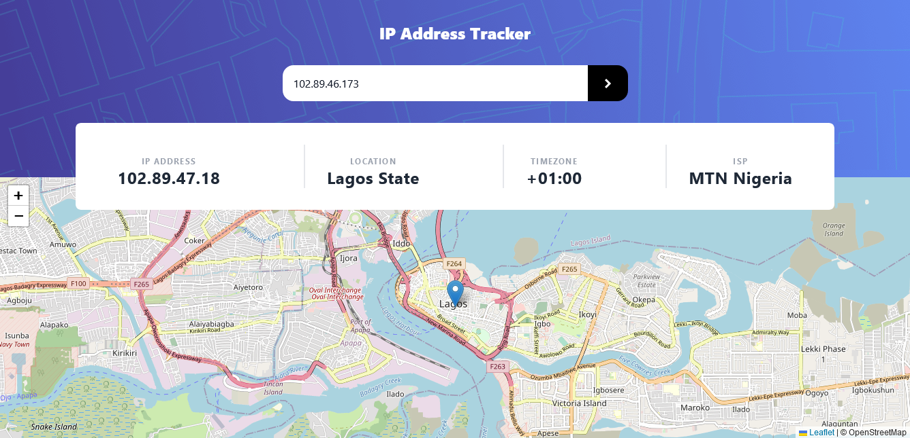
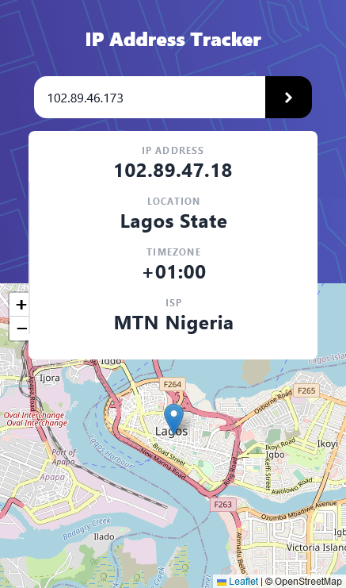

IP address tracker

## Table of contents

- [Overview](#overview)
  - [The challenge](#the-challenge)
  - [Screenshot](#screenshot)
  - [Links](#links)
  - [Built with](#built-with)
  - [Useful resources](#useful-resources)
- [Author](#author)

## Overview

This is an IP address tracker built with 2 different APIs, it tracks an API and displays the location, timezone and ISP

### The challenge

Users should be able to:

- View the optimal layout for each page depending on their device's screen size
- See hover states for all interactive elements on the page
- See their own IP address on the map on the initial page load
- Search for any IP addresses or domains and see the key information and location

### Screenshot

### Links

- Solution URL: (https://github.com/pipicoker/IP-adress-tracker)
- Live Site URL: (https://ip-adress-tracking.netlify.app/)

### Built with

- Semantic HTML5 markup
- CSS custom properties
- Tailwind css
- Javascript
- Mobile-first workflow

### Useful resources

- [IP Geolocation API by IPify](https://geo.ipify.org/) - I used this API to get the IP adress location.
- [LeafletJS](https://leafletjs.com/) - This was used to generate the map.

## Author

- Website - [Princess Ekere](https://princess-ekere.netlify.app/)
- Twitter - [@affizey](https://twitter.com/affizey)
